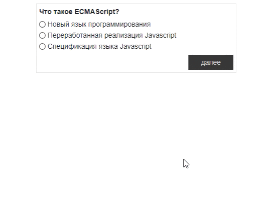

# Simple-Testing-App

## Основное задание

Реализуйте средставми JS, JQuery или ReactJS/Angular обычный тест.  
Дан ассоциативный массив с вопросами и правильными ответами. Вопросы должны показываться по одному. 
Вырианты ответов реализованы через - радио-кнопочки.

Пользователь может двигаться по вопросам нажатием на кнопку - "далее". 
Если пользователь не выбрал ни один из ответов, он получает - alert и никуда не двигается.

После того, как пользователь ответит на все вопросы должна появиться итоговая страница с ответами. 
Под вопросами должен быть следующее: 
- верный ответ (зеленым цветом) если пользователь ответил правильно, и
- не верный ответ (красным цветом), если пользователь ответил не правильно, а под ним верный цвет (серым цветом)

Внизу должна быть надпись, отображающая количество правильных ответов и
кнопка предлагающая пройти тестирование заново.

## Комментарии: 
  Тесты загружаются из файла tests.js (JSON), 
  Используются три компонента:
  - App - родитель
  - NextTest - отвечает за постраничный вывод тестов
  - Result - компонент итогового вывода 

<i>Реализация - Production под NodeJS</i>
